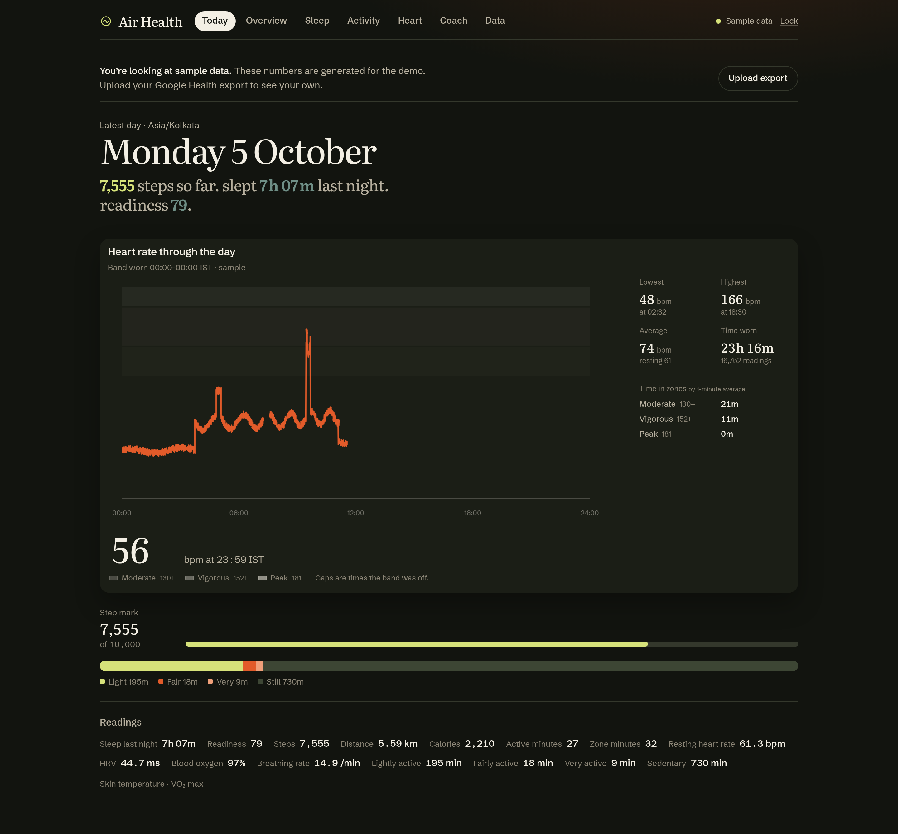
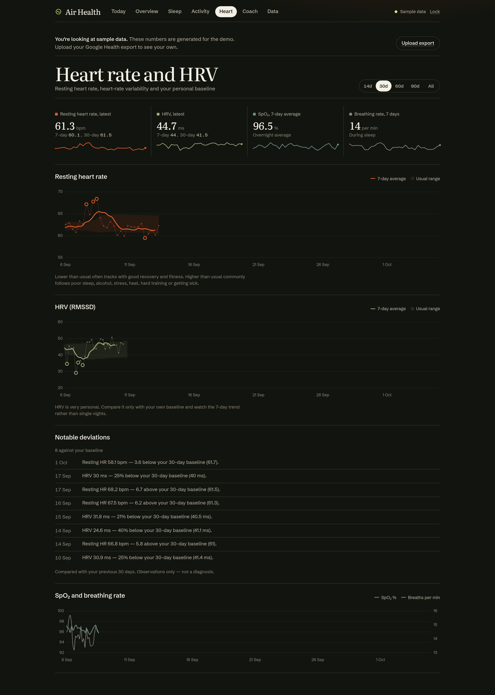
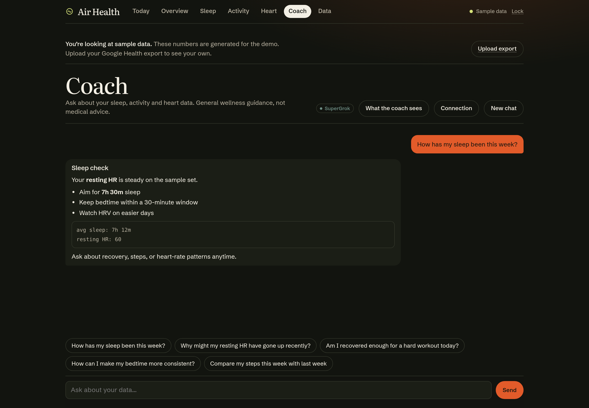
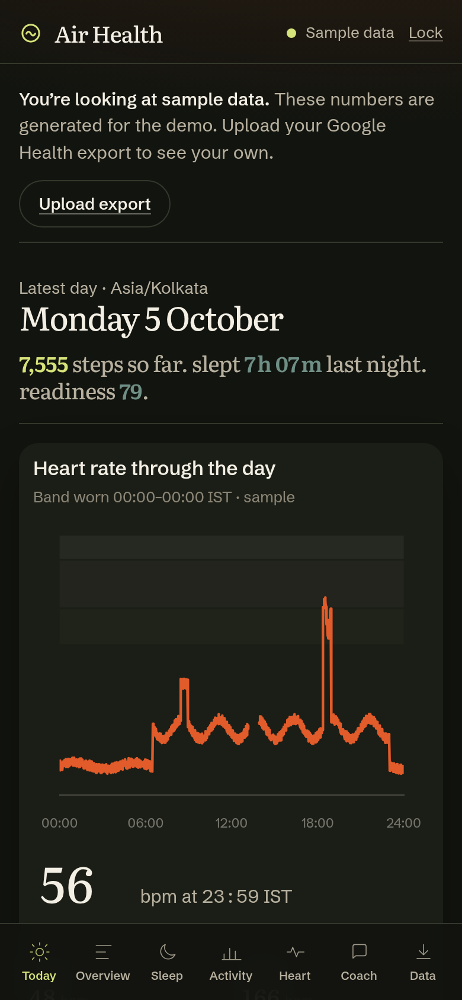

# Air Health

**Local-first** dashboard for Fitbit Air / Google Health: sleep & recovery, steps & activity, heart rate (including through-the-day HR), plus an optional AI coach.

Your metrics stay on **the machine you run**. There is no Air Health cloud for health data — only optional Coach calls you configure yourself (SuperGrok or an API key).



## Why self-host

- **Privacy** — store, passcode, OAuth tokens, and exports live under `data/` (gitignored)
- **Your network** — phone sync talks only to the dashboard URL you set (usually Tailscale)
- **No account required** for the dashboard itself — one passcode on first run

> Screenshots below use **sample** numbers, not anyone’s real health export.

<p align="center">
  
  
</p>

## Quick start

```bash
git clone https://github.com/blakster/air-health.git
cd air-health
cp .env.example .env   # optional
npm install
./start.sh             # http://localhost:4870  (override with PORT=…)
```

Passcode is written to `data/.passcode` on first run (or set `APP_PASSCODE` in `.env`).

Stack: Node 22 + Express, vanilla JS + Chart.js — no frontend build step. JSON store: `data/store.json`.

## Data sources

### 1. Google Takeout

1. Export Fitbit / Google Health from [Google Takeout](https://takeout.google.com/)
2. Open **Data** in the dashboard → upload the zip(s), an extracted folder, or loose JSON/CSV
3. Until you import, the UI shows clearly labelled **sample data** (~60 days)

### 2. Phone sync (Health Connect)

Use the companion app **Air Health Sync** so your phone can push Health Connect summaries to this dashboard.

1. Install the release APK from [Releases](https://github.com/blakster/air-health/releases) (or build from `android/` — see [android/README.md](android/README.md))
2. Put the phone and the dashboard host on the same private network — **Tailscale is the usual path** (`tailscale ip -4` on the host)
3. In `.env`, set the URL the phone should use when the browser is on localhost:

   ```bash
   PUBLIC_SYNC_URL=http://YOUR_TAILSCALE_IP:4870
   # or
   TAILSCALE_URL=http://YOUR_TAILSCALE_IP:4870
   ```

4. **Data → Phone sync → Pair phone** — scan the QR or enter the one-time code
5. In the Android app, set **Server URL** to `http://YOUR_TAILSCALE_IP:4870` (placeholder in the APK is exactly that string)

Cleartext HTTP is allowed for Tailscale/LAN sync; WireGuard already encrypts the tailnet. The phone stores a device token in Android Keystore; the server keeps only a hash.

### Sideload the APK

1. Download `AirHealthSync-1.1.0.apk` from the [latest release](https://github.com/blakster/air-health/releases/latest)
2. On Android: allow install from your browser/files app → open the APK
3. Grant Health Connect permissions when prompted
4. Open the app → set server URL → pair from the dashboard

Background sync runs about every 15 minutes while the phone can reach the server (Tailscale connected). Health Connect keeps collecting on-device when Tailscale is off; the next successful session catches the dashboard up.

## Coach

On the **Coach** page:

1. **Connect SuperGrok** — device-code login (tokens in `data/.coach-oauth.json`), or
2. **API key** — XAI / OpenAI / Anthropic / Gemini (saved under `data/.coach-secrets.json`, or set keys in `.env`)

Keys never go to the browser. Coach receives a compact snapshot of loaded metrics (not the raw Takeout zip). Wellness guidance only — **not medical advice**.

Optional personalization:

```bash
DISPLAY_NAME=Alex   # greeting + coach tone; default "there"
```

## Privacy

| What | Where |
|------|--------|
| Metrics, imports, passcode | `data/` on your machine — **not** in git |
| Phone ↔ dashboard | Only the URL you configure |
| Coach providers | Only the prompt context the app builds (see in-app “What the coach sees”) |
| Android companion | No analytics SDK |

## Screenshots

| Today | Heart | Coach |
|-------|-------|-------|
|  |  |  |

Mobile: 

## Tests

```bash
python3 scripts/make_synthetic_export.py /tmp/synthetic_takeout.zip
node scripts/test_parser.js /tmp/synthetic_takeout.zip
node scripts/test_coach_oauth.js
node scripts/test_hc_ingest.js
```

## Android companion

See [`android/README.md`](android/README.md). Release signing keystores and passwords are **not** in this repo (`android/keystore/` is gitignored); run `android/make-keystore.sh` once on your machine if you build releases yourself.

## License

MIT — see [LICENSE](LICENSE).
